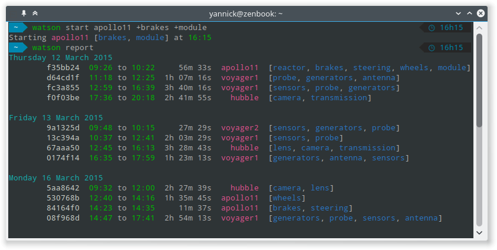

## Overview

Watson is here to help you monitor your time. You want to know how
much time you are spending on your projects? You want to generate a nice
report for your client? Watson is here for you.

Tell Watson when you start working on a task with the `start` command.
Then, when you are done, stop the timer with the `stop`
command. This will create what we call a **frame**. That's pretty much
everything you need to know to start using Watson.

Each frame consists of the name of a project and some tags. Your tags
can be shared across projects and can be used to generate detailed
reports.

Watson stores everything on your computer, but you can go wild and
upload to your own [crick server](https://github.com/TailorDev/crick)
via the `sync` command to store your sessions remotely and share them
with your colleagues.



## Installation

Watson is available on any platform supported by Python (Windows, Mac,
Linux, *BSD…). The easiest way to install it is to use
[pip](https://pip.pypa.io/en/stable/installing/):

```bash
$ pip install td-watson
```

Depending on your system, you might need to run this command with root privileges in order to install Watson globally.

On OS X, the easiest way to install Watson is using [Homebrew](http://brew.sh/):

```bash
$ brew update && brew install watson
```

### Distribution packages

You can install Watson using available distribution packages.

**Arch Linux**

A `PKGBUILD` file for building an Arch Linux package is available in the
[AUR](https://aur.archlinux.org/packages/watson/). You can build and
install it using the [makepkg](https://wiki.archlinux.org/index.php/Makepkg)
or an [AUR helper](https://wiki.archlinux.org/index.php/AUR_helpers).
Please refer to the official documentation for more information on
installing AUR packages.

### Single user installation

You can choose to install Watson for your user only by running:

```bash
$ pip install --user td-watson
```

If after this the `watson` command is not available, you need to add `~/.local/bin/` to your `PATH`. If your terminal is Bash, you can do this by running:

```bash
$ echo 'export PATH="$HOME/.local/bin:$PATH"' >> ~/.bashrc  # Add ~/.local/bin/ to your .bashrc PATH
```

and restarting your terminal session or sourcing the `.bashrc`:

```bash
$ source ~/.bashrc  # Reload your .bashrc
```

### Development version

The latest development version can be installed using the following commands:

```bash
$ git clone https://github.com/TailorDev/Watson.git
$ cd Watson/
$ pip install -e .
```

### Command line completion

#### Bash


If you use a Bash-compatible shell, you can install the `watson.completion` file from the source distribution as `/etc/bash.completion.d/watson` - or wherever your distribution keeps the Bash completion configuration files. After you restart your shell, you can then just type `watson` on your command line and then hit `TAB` to see all available commands. Depending on your input, it completes `watson` commands, command options, projects, tags and frame IDs.

#### ZSH

If you use zsh, copy the file `watson.zsh-completion` somewhere in your
`fpath` as `_watson`. For example, you can put it in
`/usr/local/share/zsh/site-functions`:

    cp watson.zsh-completion /usr/local/share/zsh/site-functions/_watson

Make sure that your .zshrc enables compinit:

    autoload -Uz compinit && compinit

#### Fish

If you use fish, you can copy or symlink the file `watson.fish` from the source distribution to `~/.config/fish/completions/watson.fish`.
You may need to make the completions directory as it is not created by default.

Once this is done, re-source your fish config:
  `source ~/.config/fish/config.fish`

You will now have command completion for fish, including the completion of known projects, tags, and frames.


## Getting started

Now that `watson` is installed on your system, let's start tracking your activity:

```bash
$ watson start world-domination +cats
```

With this command, you have started a new **frame** for the *world-domination* project with the *cat* tag. Time is running. Now, you need to work on your project. Let's do this. Now.

{: width="400px" }

Welcome back! Now that your world domination plan has been set up, let's stop time tracking via:

```bash
$ watson stop
Project world-domination [cat] started 34 minutes ago (id: 166d1fb)
```

To list all available commands, either [explore the commands documentation](user-guide/commands.md) or use:

```bash
$ watson help
```

We hope you will enjoy Watson!
